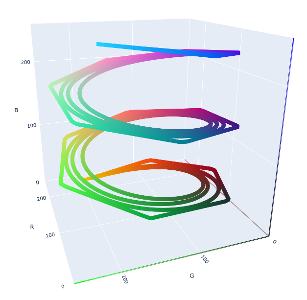
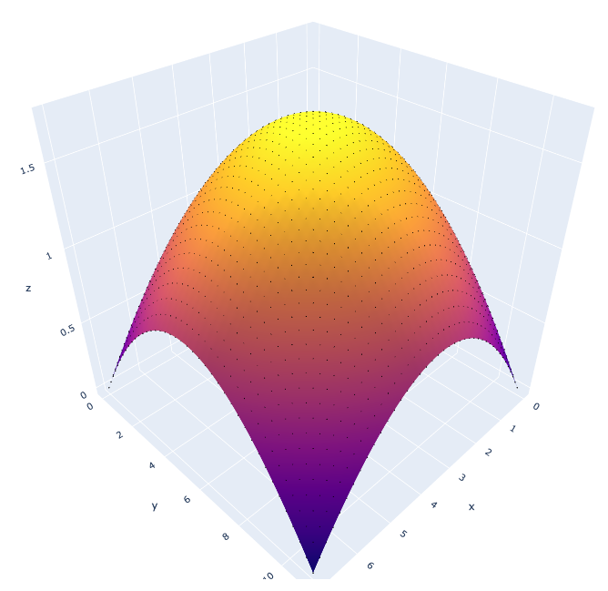

# Splines
Spline interpolation in Julia

One, two and N-dimensional splines in Julia.



The code implements NURBS (non-uniform rational b-splines), b-splines and Bezier curves.
There's lots of online resources about the maths behind these objects and the relationships between them, but briefly splines for parametric smooth curves given a set of control points (called `nodes`) here.
The simplest splines, the Bezier curves, don't need any other information. B-splines, one level up, use `knots` to specify different ways to interpolate between the nodes and accept a `degree` argument. Degree 1 bsplines are piecewise linear curvers, the higher the degree the more nodes are interpolated to specify the location of each point along the curve. Rational Bezier and rational BSplines curves use additional weights to specify how each control node affects the curve. Slines are parametrized curves, and the paranter $t$ is in range $[0, 1]$
The Julia code here exposes a `Bezier` and a `BSpline` struct, each of which can also incorporate information about weights to produce rational splines and `BSpline` can be provided with knots to produce a NURB.


```Julia
using Splines

n, m = 8, 12
degree = 3
nodes = cat([0:n-1 zeros(n) sin.(range(0, stop=π, length=n))], dims=2)'

weights = ones(size(nodes, 2))
weights[5] = 5

# bezier
Bezier(nodes)

# rational bezier
Bezier(nodes, weights)

# bspline
BSpline(nodes, degree)

# rational bspline
BSpline(nodes1, weights1, 3)
```

Two one-dimensional splines can be combined to create a two dimensional spline surface. The result is parametrized surface with paramters $(t, v) ∈ [0, 1] ⨉ [0, 1]$. The surface is also called a tensor product surface since it's generated through the tensor product ⨂ of two lower dimensional splines. In general, a N dimensional spline and an M dimensional one can be combined to give a N+M dimensional spline. The Julia code here exposes an `⨂` opeartor to take the tensor product of two splines.


```Julia
# N=1: curves
b₁ = Bezier(nodes1)
b₂ = Bezier(nodes2)
b₃ = Bezier(nodes3)

# N=2: surface
b2n = b₁ ⊗ b₂

# N=3: volume
b3n =  b2n ⊗ b₃

```



